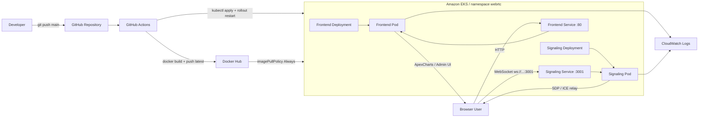
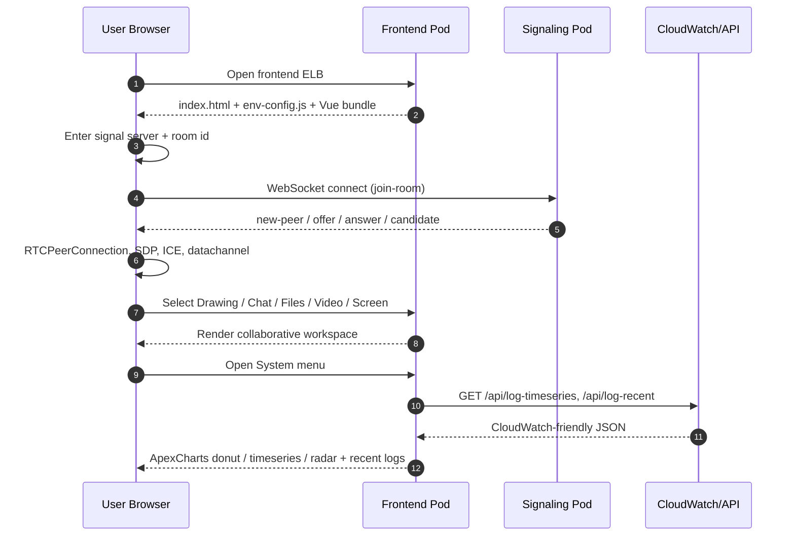
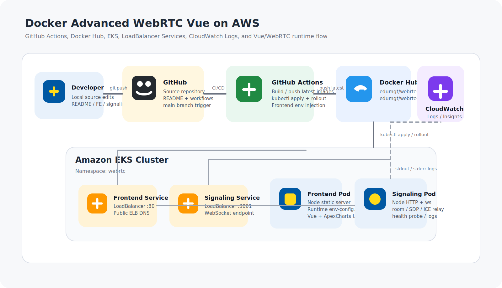
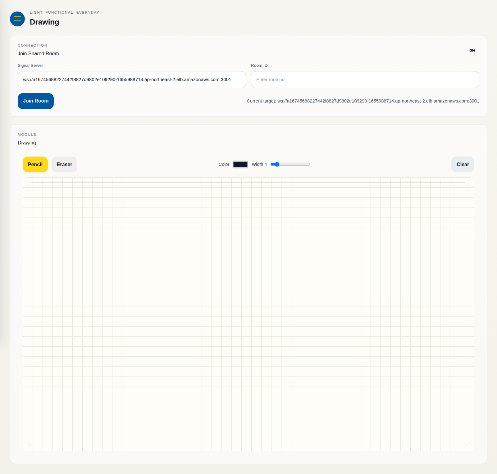
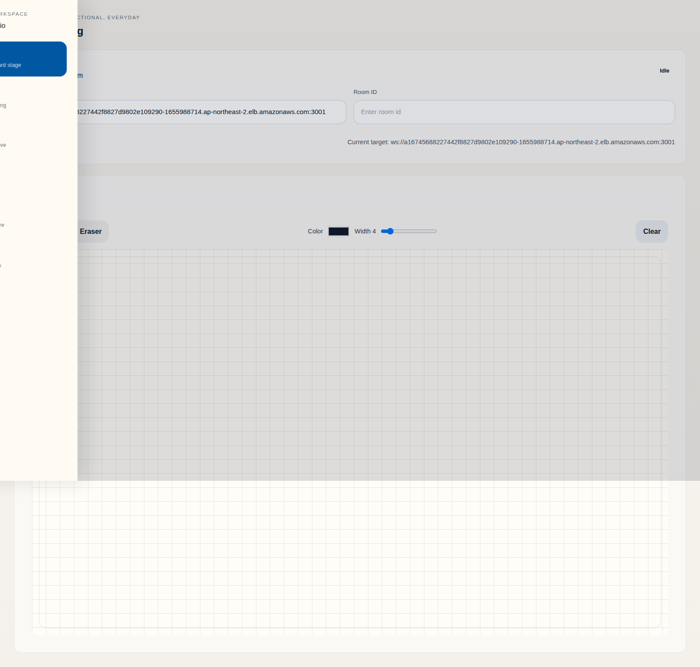
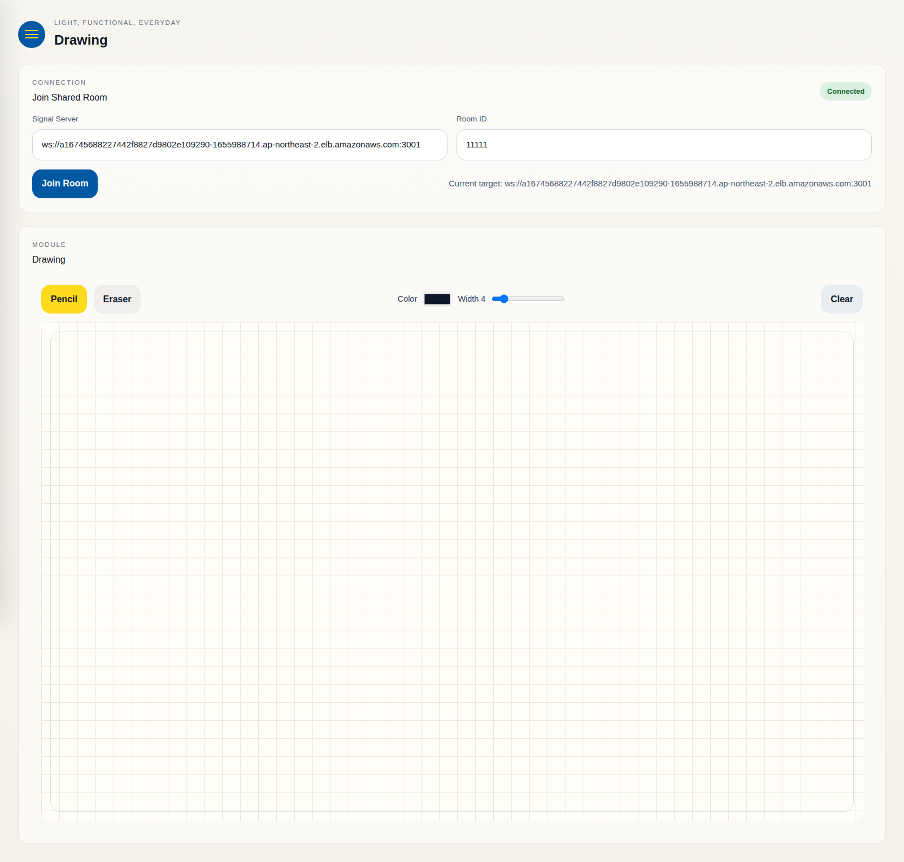
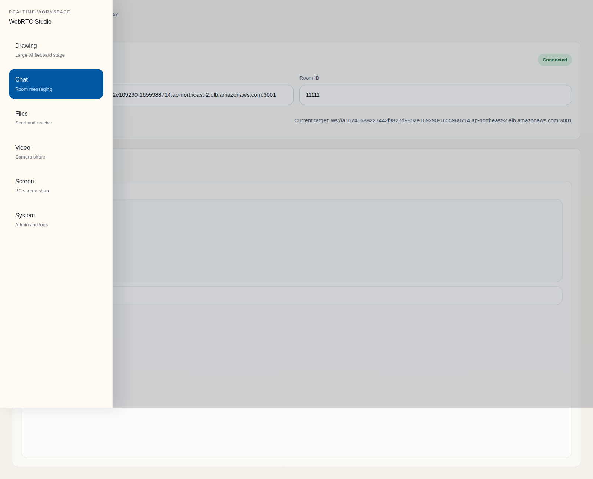
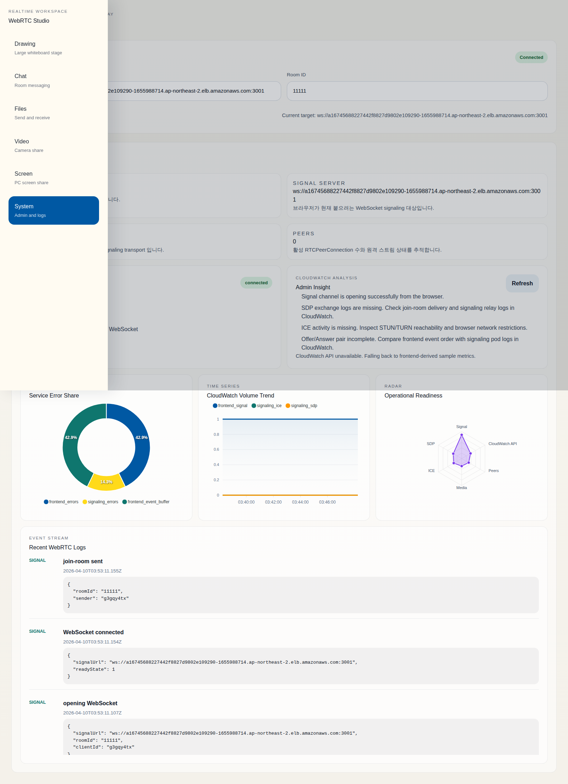

# Docker Advanced WebRTC Vue

Vue 3 기반 협업형 WebRTC 애플리케이션입니다.  
프런트엔드는 Node 정적 서버로 배포되고, signaling 서버는 별도 Node 프로세스로 분리되어 동작합니다.  
실행 환경은 Docker Hub, GitHub Actions, Amazon EKS, CloudWatch Logs를 기준으로 구성되어 있습니다.

주요 기능:
- 실시간 room join
- drawing canvas
- chat / file transfer
- camera share / screen share
- System 관리자 화면
- ApexCharts 기반 운영 차트
- Docker Hub `latest` 자동 배포 + EKS rollout

## Components

- Frontend
  [`src/App.vue`](./src/App.vue) 기준의 Vue UI와 시스템 대시보드
- Frontend runtime server
  [`frontend-server.cjs`](./frontend-server.cjs) 가 `dist`와 `env-config.js`를 서빙
- Signaling server
  [`server.cjs`](./server.cjs) 가 HTTP health check와 WebSocket signaling을 처리
- Kubernetes manifests
  [`kube-manifests`](./kube-manifests) 아래 namespace / deployment / service 정의
- CI/CD
  [`dockerhub-publish.yml`](./.github/workflows/dockerhub-publish.yml) 에서 Docker Hub push와 EKS apply/rollout 수행

## System Flow



## Sequence Diagram



## AWS Architecture

아래 SVG는 이 프로젝트의 AWS 배포 구성을 아이콘형 아키텍처로 정리한 것입니다.



구성 요약:
- GitHub Actions가 `edumgt/webrtc-frontend:latest`, `edumgt/webrtc-signaling:latest` 를 Docker Hub에 push
- EKS의 `webrtc` namespace 에 frontend / signaling deployment 가 분리 배치
- frontend service 는 `LoadBalancer :80`
- signaling service 는 `LoadBalancer :3001`
- frontend 는 런타임 env 로 signaling 주소를 주입
- frontend / signaling 로그는 CloudWatch Logs 와 연동 가능
- System 메뉴의 ApexCharts 는 `/api/log-timeseries`, `/api/log-recent` JSON 응답을 우선 사용하고, API 미구현 시 프런트 수집 로그로 폴백

## Runtime and Operations

### Frontend runtime env

frontend 이미지는 정적 번들만 서빙하지 않고, 컨테이너 시작 시점의 env 를 `env-config.js` 로 브라우저에 주입합니다.

대표 env:

```env
VITE_SIGNAL_URL=ws://<signaling-elb>:3001
VITE_SIGNAL_PORT=3001
FRONTEND_HOST=0.0.0.0
FRONTEND_PORT=80
```

### CI/CD

- push branch: `main`
- image tag policy: always overwrite `latest`
- deployment strategy:
  `kubectl apply` -> `kubectl set env` -> `kubectl rollout restart` -> `kubectl rollout status`

### CloudWatch chart integration

System 메뉴는 아래 API 포맷을 기대합니다.

- `GET /api/log-timeseries?rangeMinutes=60&binMinutes=5`
- `GET /api/log-recent?limit=20`

권장 응답 예시:

```json
{
  "rangeMinutes": 60,
  "binMinutes": 5,
  "series": [
    {
      "name": "frontend_errors",
      "data": [["2026-04-10T10:00:00Z", 3], ["2026-04-10T10:05:00Z", 1]]
    },
    {
      "name": "signaling_errors",
      "data": [["2026-04-10T10:00:00Z", 0], ["2026-04-10T10:05:00Z", 2]]
    }
  ],
  "recentLogs": [
    {
      "timestamp": "2026-04-10T10:12:10Z",
      "service": "signaling",
      "level": "error",
      "event": "websocket_connect_failed",
      "message": "timeout"
    }
  ]
}
```

## EKS Implementation Screenshots

아래 5장은 EKS에 올라간 공개 frontend ELB를 대상으로, Playwright Docker 이미지로 캡처한 실제 화면입니다.

캡처 기준:
- Frontend URL
  `http://acc748b6c0f6846a0aab7dd1cbd92d9d-1468928971.ap-northeast-2.elb.amazonaws.com`
- Signaling URL
  `ws://a16745688227442f8827d9802e109290-1655988714.ap-northeast-2.elb.amazonaws.com:3001`
- Capture runner
  `mcr.microsoft.com/playwright:v1.52.0-noble`

### 1. Home

메인 진입 화면입니다.  
Signal Server, Room ID, 연결 상태를 한 곳에서 입력하고 확인할 수 있습니다.



### 2. Offcanvas Navigation

햄버거 기반 offcanvas 메뉴입니다.  
Drawing, Chat, Files, Video, Screen, System 모듈로 빠르게 이동할 수 있습니다.



### 3. Drawing Workspace

room join 이후의 drawing 중심 화면입니다.  
대형 canvas, pencil / eraser / color / width 도구를 포함합니다.



### 4. Chat Module

채팅 모듈 화면입니다.  
offcanvas 메뉴를 통해 모듈을 전환하고, room 단위 메시지를 주고받는 구조입니다.



### 5. System Dashboard

운영자용 System 메뉴 화면입니다.  
현재 room, signal server, peer 수, CloudWatch 분석 문구, 최근 이벤트 로그, ApexCharts 차트를 함께 보여줍니다.



## Local Development

```bash
npm install
npm run build
node frontend-server.cjs
node server.cjs
```

개발 모드:

```bash
npm run dev
npm run signal
```

WSL 외부 접속 허용:

```bash
npm run dev:wsl
```

## Key Files

- [`src/App.vue`](./src/App.vue)
- [`src/composables/useWebRTC.js`](./src/composables/useWebRTC.js)
- [`src/components/Whiteboard.vue`](./src/components/Whiteboard.vue)
- [`src/components/SystemPanel.vue`](./src/components/SystemPanel.vue)
- [`frontend-server.cjs`](./frontend-server.cjs)
- [`server.cjs`](./server.cjs)
- [`Dockerfile.frontend`](./Dockerfile.frontend)
- [`Dockerfile.1`](./Dockerfile.1)
- [`docker-compose.yml`](./docker-compose.yml)
- [`kube-manifests/04-webrtc-frontend-deployment.yml`](./kube-manifests/04-webrtc-frontend-deployment.yml)
- [`kube-manifests/02-webrtc-deployment.yml`](./kube-manifests/02-webrtc-deployment.yml)
- [`kube-manifests/03-webrtc-loadbalancer-service.yml`](./kube-manifests/03-webrtc-loadbalancer-service.yml)
- [`DOC/aws-webrtc-architecture.svg`](./DOC/aws-webrtc-architecture.svg)

## Screenshot Reproduction

README 스크린샷은 아래 명령으로 다시 생성할 수 있습니다.

```bash
docker run --rm \
  -v /home/Docker-Advanced-WebRTC-Vue:/work \
  -w /work \
  mcr.microsoft.com/playwright:v1.52.0-noble \
  bash -lc 'npx playwright test scripts/readme-screenshots.spec.mjs --reporter=line'
```
